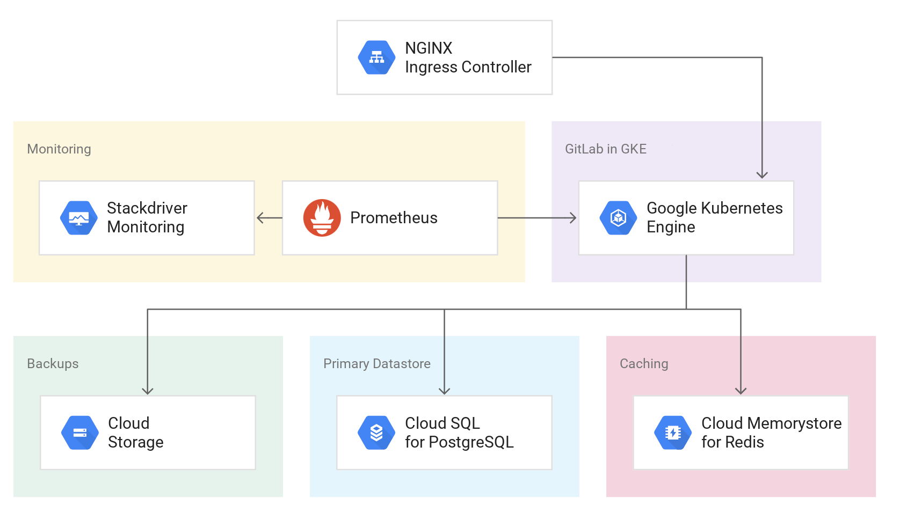

# terraform-google-gke-gitlab

This module creates a reslient and fault tolerant GitLab installation using Google
Kubernetes Engine (GKE) as the computing environment and the following services for storing
data:
- CloudSQL for PostgreSQL
- Memorystore for Redis
- Cloud Storage



## Compatibility

This module is meant for use with Terraform 0.13+ and tested using Terraform 0.14.

## Usage
There are examples included in the [examples](./examples/) folder but simple usage is as follows:

```hcl
module "gke-gitlab" {
  source                     = "terraform-google-modules/gke-gitlab/google"
  project_id                 = "<PROJECT ID>"
  certmanager_email          = "test@example.com"
}
```

Then perform the following commands on the root folder:

- `terraform init` to get the plugins
- `terraform plan` to see the infrastructure plan
- `terraform apply` to apply the infrastructure build
- `terraform destroy` to destroy the built infrastructure


<!-- BEGINNING OF PRE-COMMIT-TERRAFORM DOCS HOOK -->
## Inputs

| Name | Description | Type | Default | Required |
|------|-------------|------|---------|:--------:|
| allow\_force\_destroy | Allows full cleanup of resources by disabling any deletion safe guards | `bool` | `false` | no |
| certmanager\_email | Email used to retrieve SSL certificates from Let's Encrypt | `string` | n/a | yes |
| domain | Domain for hosting gitlab functionality (ie mydomain.com would access gitlab at gitlab.mydomain.com) | `string` | `""` | no |
| gitlab\_address\_name | Name of the address to use for GitLab ingress | `string` | `""` | no |
| gitlab\_db\_name | Instance name for the GitLab Postgres database. | `string` | `"gitlab-db"` | no |
| gitlab\_db\_password | Password for the GitLab Postgres user | `string` | `""` | no |
| gitlab\_db\_random\_prefix | Sets random suffix at the end of the Cloud SQL instance name. | `bool` | `false` | no |
| gitlab\_deletion\_protection | Must be false to allow Terraform to destroy the Cloud SQL instance. | `bool` | `true` | no |
| gitlab\_nodes\_subnet\_cidr | Cidr range to use for gitlab GKE nodes subnet | `string` | `"10.0.0.0/16"` | no |
| gitlab\_pods\_subnet\_cidr | Cidr range to use for gitlab GKE pods subnet | `string` | `"10.3.0.0/16"` | no |
| gitlab\_runner\_install | Choose whether to install the gitlab runner in the cluster | `bool` | `true` | no |
| gitlab\_services\_subnet\_cidr | Cidr range to use for gitlab GKE services subnet | `string` | `"10.2.0.0/16"` | no |
| gke\_machine\_type | Machine type used for the node-pool | `string` | `"n1-standard-4"` | no |
| helm\_chart\_version | Helm chart version to install during deployment | `string` | `"4.2.4"` | no |
| project\_id | GCP Project to deploy resources | `string` | n/a | yes |
| region | GCP region to deploy resources to | `string` | `"us-central1"` | no |

## Outputs

| Name | Description |
|------|-------------|
| cluster\_ca\_certificate | CA Certificate for the GKE cluster that GitLab is deployed in. |
| cluster\_location | Location of the GKE cluster that GitLab is deployed in. |
| cluster\_name | Name of the GKE cluster that GitLab is deployed in. |
| gitlab\_address | IP address where you can connect to your GitLab instance |
| gitlab\_url | URL where you can access your GitLab instance |
| host | Host for the GKE cluster that GitLab is deployed in. |
| root\_password\_instructions | Instructions for getting the root user's password for initial setup |
| token | Token for the GKE cluster that GitLab is deployed in. |

<!-- END OF PRE-COMMIT-TERRAFORM DOCS HOOK -->

## Requirements

Before this module can be used on a project, you must ensure that the following pre-requisites are fulfilled:

1. Terraform is [installed](#software-dependencies) on the machine where Terraform is executed.
2. The Service Account you execute the module with has the right [permissions](#configure-a-service-account).

The [project factory](https://github.com/terraform-google-modules/terraform-google-project-factory) can be used to provision projects with the correct APIs active.

### Software Dependencies
### Terraform
- [Terraform](https://www.terraform.io/downloads.html) 0.13+
- [terraform-provider-google](https://github.com/terraform-providers/terraform-provider-google) ~> 3.44

### Configure a Service Account
In order to execute this module you must have a Service Account with the
following project roles:
- roles/owner

## Install

### Terraform
Be sure you have the correct Terraform version, you can choose the binary here:
- https://releases.hashicorp.com/terraform/

## File structure
The project has the following folders and files:

- /: root folder
- /examples: examples for using this module
- /helpers: Helper scripts
- /test: Folders with files for testing the module (see Testing section on this file)
- /main.tf: main file for this module, contains all the resources to create
- /variables.tf: all the variables for the module
- /output.tf: the outputs of the module
- /README.md: this file
